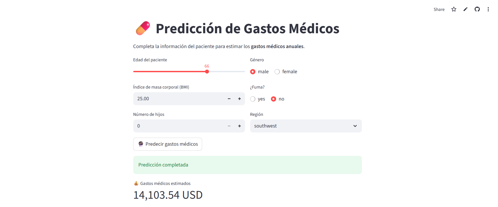

# 🧠 Medical Charges Prediction - Regression Model

Este proyecto consiste en la predicción de gastos médicos (`charges`) usando un modelo de regresión entrenado con datos demográficos y de estilo de vida de pacientes.

---

## 📊 Dataset

Se utiliza un dataset de seguros médicos que incluye variables como:

- `age`: Edad del paciente
- `sex`: Género
- `bmi`: Índice de masa corporal
- `children`: Número de hijos dependientes
- `smoker`: Si el paciente fuma o no
- `region`: Región geográfica
- `charges`: Gastos médicos anuales (variable objetivo)

---

## 🧹 Preprocesamiento

Se realizaron las siguientes tareas de limpieza y preparación:

- Imputación de valores nulos:
  - Edad -> teniendo encuenta filas con resto de columnas parecidas.
  - Sexo -> con Random Forest Classifier
  - BMI -> con Random Forest Regressor
  - Resto de Variables categóricas y numéricas -> con la moda y mediana
- Eliminación de outliers mediante filtrado entre el **percentil 25 (Q1)** y **percentil 75 (Q3)** de la variable `charges`
- Codificación one-hot de variables categóricas
- Escalado de variables numéricas
- Pipeline con `ColumnTransformer` para asegurar un flujo limpio y reproducible

---

## 🤖 Modelo utilizado

Se entrenó un modelo de **XGBoost Regressor**, integrado dentro de un pipeline con `GridSearchCV` para búsqueda de hiperparámetros.

### 🔍 Hiperparámetros ajustados

- `n_estimators`: número de árboles
- `max_depth`: profundidad máxima de cada árbol
- `learning_rate`: tasa de aprendizaje
- `subsample`: proporción de datos usada por cada árbol

---

## ✅ Resultados

Evaluación del modelo sobre un conjunto de test:

- **RMSE:** `991.32`
- **R² score:** `0.88`

Esto indica que el modelo tiene un **error promedio bajo** y **explica el 88% de la variabilidad** en los gastos médicos, siendo una herramienta precisa para predicción en este dominio.

---

## 📈 Próximos pasos

- Aplicar técnicas de interpretación como **SHAP values** o `feature_importances_`
- Exportar el modelo entrenado con `joblib` para uso en producción o APIs

---

## 🛠️ Tecnologías usadas

- Python
- pandas, numpy
- matplotlib, seaborn
- scikit-learn
- xgboost

---

## 📬 Contacto

- Nombre: Fernando González Laso
- Correo: gonzalezlasof@gmail.com
- [Linkedin](https://www.linkedin.com/in/fernando-gonz%C3%A1lez-laso-b55b77250/)

